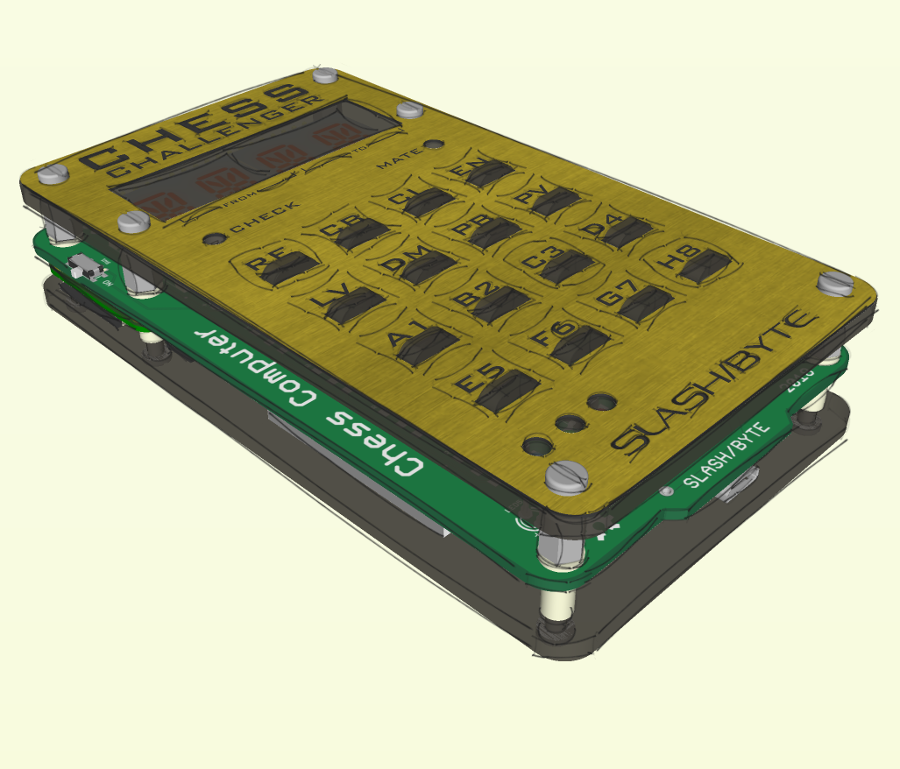

# PI Chess Computer
Modeled after the "Chess Challenger" made in 1978.
This PI powered, retro themed build,
is an open source hardware design capable of running an up to date chess engine, Stockfish.

## Raspberry PI Image Release
[Chess Challenger PI Image](https://github.com/slashbyte/ChessComputer-Source/releases)

### Computer Chess Clubs, BEWARE!
(Thats still a thing, right?)

## Authors
* **Slash/Byte**
## License
This project is licensed under the MIT License
(https://opensource.org/licenses/MIT)
## Acknowledgments
* Science
* Adafruit
* Ponoko (Great fab house)
* Digikey
